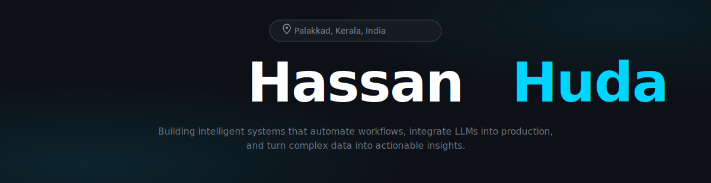

<!-- ═══════════════════════════════════════════════════════════════ -->
<!--                        HERO BANNER                             -->
<!-- ═══════════════════════════════════════════════════════════════ -->

 

<!-- Typing animation -->

 

<!-- CTA Buttons -->

&nbsp;&nbsp;

  

<!-- Profile views + followers -->

&nbsp;

 

<!-- ═══════════════════════════════════════════════════════════════ -->
<!--                        ABOUT                                   -->
<!-- ═══════════════════════════════════════════════════════════════ -->

 

<table>
<tr>
<td valign="top" width="55%">

### 🧠 &nbsp;About Me

I'm an **AI Engineer** passionate about **Machine Learning**, **LLMs**, **Computer Vision**, and **Automation**.

I love bridging the gap between raw data and production-ready intelligence — crafting solutions that are **scalable**, **clean**, and genuinely impactful.

</td>
<td valign="top" width="45%">

### 🚀 &nbsp;Currently Building

- 🧩 **RAG-powered AI assistants** for education & research
- 🤖 **LLM pipelines** and **AI agent frameworks**
- 🧠 **Generative AI** + **Vector Database** systems
- ☁️ **MLOps** workflows and deployment pipelines

</td>
</tr>
</table>

 

<!-- ═══════════════════════════════════════════════════════════════ -->
<!--                    FEATURED PROJECTS                           -->
<!-- ═══════════════════════════════════════════════════════════════ -->

 

### 🌟 &nbsp;Featured Projects

 

<table>
<tr>

<td valign="top" width="33%">

<a href="https://github.com/HassanCodesIt/RAG-Study-Assistant"><b>🧩 RAG Study Assistant</b></a>

<b>AI-Powered PDF Learning Platform</b>

A PDF-based RAG system that lets students upload study materials and ask natural language questions. Extracts, chunks, and queries PDFs using semantic search.

 

</td>

<td valign="top" width="33%">

<a href="https://github.com/HassanCodesIt/AI-powered-journalism"><b>📰 AI-Powered Journalism</b></a>

<b>News Intelligence System</b>

Flask web app that scrapes BBC World RSS feeds, extracts full article text, and generates intelligence-grade news summaries using LLM pipelines.

 

</td>

<td valign="top" width="33%">

<a href="https://github.com/HassanCodesIt/medical-patient-routing-assistant"><b>🩺 Medical Patient Routing</b></a>

<b>Clinical AI Triage System</b>

FastAPI-based clinical triage engine that analyzes patient symptoms using Groq LLaMA 3 and routes them to the most appropriate medical specialist.

 

</td>

</tr>
<tr>

<td valign="top" width="33%">

<a href="https://github.com/HassanCodesIt/NexusAI-AI-powered-searching"><b>🧠 NexusAI Search Chatbot</b></a>

<b>Web-Integrated AI Search</b>

Web-integrated chatbot that fetches live data, indexes it in ChromaDB, and answers queries in real time using semantic search and HuggingFace embeddings.

 

</td>

<td valign="top" width="33%">

<a href="https://github.com/HassanCodesIt/corn-leaf-disease-detection"><b>🌽 Corn Leaf Disease Detection</b></a>

<b>Deep Learning Vision</b>

YOLOv8 deep learning model trained on 4,924 images to detect 7 corn leaf diseases with high precision, enabling early agricultural disease diagnosis.

 

</td>

<td valign="top" width="33%">

<a href="https://github.com/HassanCodesIt/Resume-Reviewer"><b>🧾 Resume Reviewer</b></a>

<b>AI-Driven Resume Analysis</b>

AI-powered resume analysis tool with NLP-based skill gap detection, ATS compatibility scoring, and actionable improvement suggestions for job seekers.

 

</td>

</tr>
</table>

 

 

<!-- ═══════════════════════════════════════════════════════════════ -->
<!--                      TECH STACK                                -->
<!-- ═══════════════════════════════════════════════════════════════ -->

 

### ⚙️ &nbsp;Tech Arsenal

 

 

<!-- ═══════════════════════════════════════════════════════════════ -->
<!--                    GITHUB ANALYTICS                            -->
<!-- ═══════════════════════════════════════════════════════════════ -->

 

### 📊 &nbsp;GitHub Analytics

 

&nbsp;

  

 

<!-- ═══════════════════════════════════════════════════════════════ -->
<!--                       CONNECT                                  -->
<!-- ═══════════════════════════════════════════════════════════════ -->

 

### 🤝 &nbsp;Let's Connect

 

  

> *"AI is not just about building models — it's about solving meaningful problems."*

 

